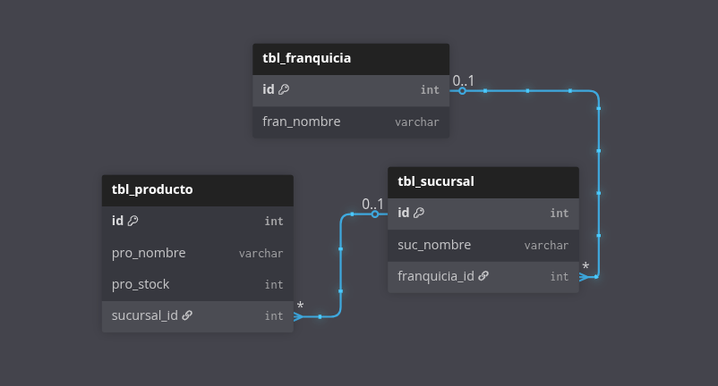
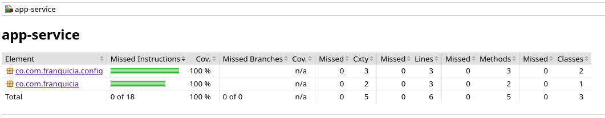
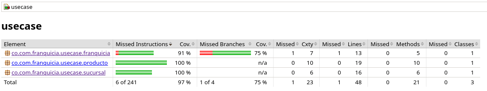
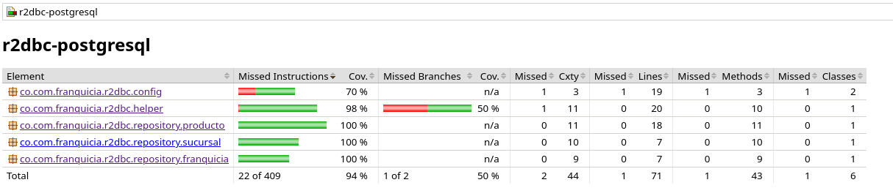
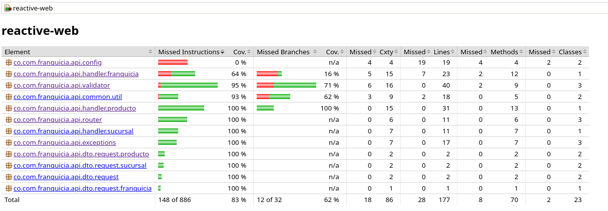

# API GESTIÓN DE FRANQUICIAS

Lee el artículo [Clean Architecture — Aislando los detalles](https://medium.com/bancolombia-tech/clean-architecture-aislando-los-detalles-4f9530f35d7a)

# Arquitectura planteada


# Descripción

Esta API gestiona una lista de franquicias, donde cada franquicia incluye un nombre y un conjunto de sucursales. Cada sucursal está compuesta por un nombre y un productos disponibles. A su vez, cada producto contiene un nombre y una cantidad de stock.

La aplicación está desarrollada en Java 21 utilizando Spring Boot con programación reactiva Webflux con una base de datos PostgreSQL.

# Requisitos Previos

- JDK 21 -> Puede usar SDKMAN
- Configurar java con SDKMAN o Manualmente en variables de entorno JAVA_HOME
- MySQL 8.0.*
- Docker

# Modelo de Base de Datos



# Pasos para verificar y levantar la API
Es importante que siga estos pasos sin omitir ninguno para un levantamiento correcto. Diríjase a la raíz principal del proyecto.

### 1. Limpiar y contruir el proyecto omitiendo las pruebas unitarias
```bash
$ ./gradlew clean build -x test
```

### 2. Levantar BD PostgreSQL en el contenedor Docker

```docker
# 1. Creamos una red en docker para poder conectar la BD con la API
$ docker network create ms-network

# 2. Arrancamos PostgreSQL
$ docker run -d \
  --name db_franquicia \
  --network ms-network \
  -e POSTGRES_USER=postgres \
  -e POSTGRES_PASSWORD=postgres \
  -e POSTGRES_DB=db_gestion_franquicia \
  -p 5432:5432 \
  postgres:17

# 3. Levantamos la informacion a la BD
$ docker exec -i db_franquicia psql -U postgres -d db_gestion_franquicia < init.sql

# "Debe exportar estas variables de entorno si desea correr los test unitarios"
# export SPRING_HOST=localhost
# export SPRING_PUERTO=5433
# export SPRING_DATABASE=db_gestion_franquicia
# export SPRING_USERNAME=postgres
# export SPRING_PASSWORD=postgres

# 4. Corremos los Tests con los parametros de la base de datos
$ ./gradlew test
```

### 3. Covertura de de la capa APPLICATIONS - 100%


### 4. Covertura de de la capa DOMAIN - 97%


### 5. Covertura de de la capa INFRAESTRUCTURA - 94%, 83% 




### 6. Levantar la API
Seguir los pasos para levantar la API y realizar las pruebas correspondientes

```docker
# Contruir el proyecto
$ docker build -t ms-franquicia-reactive .

# Levantar el proyecto con los parametros adecuados
$ docker run -d --name ms_franquicia --network ms-network \
  -e SPRING_HOST=db_franquicia \
  -e SPRING_PUERTO=5432 \
  -e SPRING_DATABASE=db_gestion_franquicia \
  -e SPRING_USERNAME=postgres \
  -e SPRING_PASSWORD=postgres \
  -p 8080:8080 \
  ms-franquicia-reactive
```

Ejecutar docker para ver los contenedores inicializados
```docker
$ docker ps
```

# Endpoints
## Endpoints Franquicias
```bash
# AGREGAR UNA NUEVA FRANQUICIA, eliminar las llaves: {}
GET http://localhost:8080/api/v1/franquicia/{nombre_franquicia}
Content-Type: application/json
```

```bash
# ACTUALIZAR EL NOMBRE DE UNA FRANQUICIA
PUT http://localhost:8080/api/v1/franquicia
Content-Type: application/json

{
    "id": 1,
    "nombre": "nombre de la franquicia"
}
```

## Endpoints Sucursal

```bash
# AGREGAR UNA NUEVA SUCURSAL
POST http://localhost:8080/api/v1/sucursal
Content-Type: application/json

{
  "nombre": "nombre de la sucursal",
  "franquicia": {
    "id": 1
  }
}
```

```bash
# ACTUALIZAR EL NOMBRE DE UNA SUCURSAL
PUT http://localhost:8080/api/v1/sucursal
Content-Type: application/json

{
    "id": 14,
    "nombre": "nombre de la sucursal"
}
```

## Endpoints Producto

```bash
# AGREGAR UN NUEVO PRODUCTO
POST http://localhost:8080/api/v1/producto
Content-Type: application/json

{
  "nombre": "nombre del producto",
  "stock": 3,
  "sucursal": {
    "id": 12
  }
}
```

```bash
# ELIMINAR UN PRODUCTO
DELETE http://localhost:8080/api/v1/producto/1
Content-Type: application/json
```

```bash
# ACTUALIZAR EL STOCK DE UN PRODUCTO
PUT http://localhost:8080/api/v1/producto
Content-Type: application/json

{
    "id": 52,
    "stock": 222
}
```

```bash
# OBTENER EL STOCK DE UN PRODUCTO PERTENECIENTE DE UN SUSCURSAL
GET http://localhost:8080/api/v1/producto/1
Content-Type: application/json
```

### Nota
No utilicé Terraform para esta prueba ya que había agotado los recursos gratuitos disponibles en la nube, lo que impedía realizar pruebas con infraestructura real. Sin embargo, tengo entendido que existe LocalStack, que permite simular servicios de AWS de manera local, lo cual es útil para pruebas sin consumir recursos de la nube.